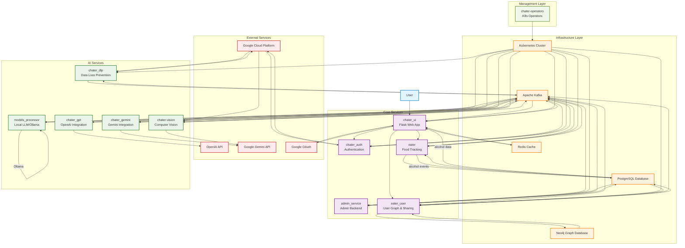
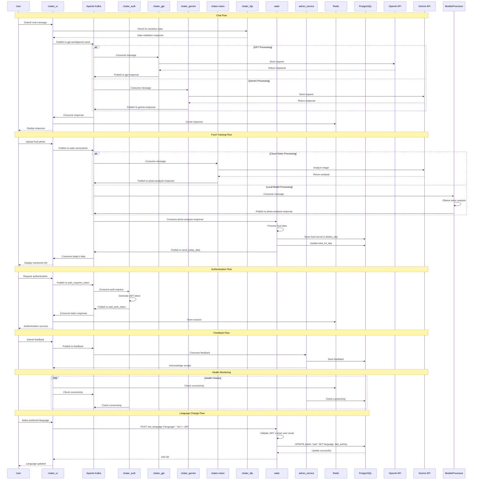

# Chater: Intelligent Chat & Food Tracking Platform

A comprehensive microservices-based application that combines AI-powered chat functionality with intelligent food tracking capabilities. Built with modern cloud-native architecture and featuring seamless integrations with multiple AI providers.

## 🚀 Features

### 💬 AI-Powered Chat
- **Multi-Provider AI Integration**: Support for OpenAI GPT and Google Gemini models
- **Vision Processing**: Advanced image analysis and recognition capabilities
- **Intelligent Responses**: Context-aware conversations with memory persistence
- **Real-time Communication**: Kafka-based messaging for instant responses

### 🍽️ Smart Food Tracking
- **Photo Analysis**: AI-powered food recognition from images
- **Nutritional Insights**: Automated calorie and nutrient tracking
- **Personalized Recommendations**: AI-driven meal suggestions
- **Data Visualization**: Comprehensive food intake analytics
 - **Alcohol Tracking**: Detect alcoholic drinks, log consumption, and query summaries/ranges

### 🔐 Enterprise Security
- **Multi-Factor Authentication**: JWT tokens with Google OAuth integration
- **Data Loss Prevention**: Google Cloud DLP integration for sensitive data protection
- **Session Management**: Redis-based secure session handling
- **Role-Based Access Control**: Fine-grained permission management

### 📊 Modern Architecture
- **Microservices Design**: Scalable, maintainable service architecture
- **Cloud-Native**: Built for Kubernetes with custom operators
- **Real-time Processing**: Apache Kafka for asynchronous communication
- **High Availability**: Resilient design with health checks and monitoring

## 🏗️ Architecture Overview

The system is composed of multiple specialized microservices, each handling specific functionality:

### Core Services
- **chater_ui**: Main Flask web application providing the user interface
- **admin_service**: Administrative functionality and feedback processing
- **chater_auth**: Authentication and authorization service
- **eater**: Food tracking and nutritional analysis service
 - **eater_user**: User search (autocomplete), friendships, and food sharing service

### AI & Processing Services
- **chater_gpt**: OpenAI GPT integration service
- **chater_gemini**: Google Gemini AI integration service
- **chater-vision**: Image processing and computer vision service
- **chater_dlp**: Data Loss Prevention service for sensitive data handling
- **models_processor**: Local LLM integration using Ollama for self-hosted AI processing

### Infrastructure Services
- **chater-operators**: Kubernetes operators for service management
- **Kafka**: Message broker for inter-service communication
- **Redis**: Caching and session management
- **PostgreSQL**: Primary data storage
 - **Neo4j**: Graph database for social relationships

## 🛠️ Technology Stack

### Backend Technologies
- **Python**: Flask web framework, data processing services
- **Java**: High-performance services for authentication and vision processing
- **Protocol Buffers**: Efficient inter-service communication
- **Apache Kafka**: Event streaming and messaging
- **PostgreSQL**: Relational database for persistent storage
- **Redis**: In-memory caching and session store
 - **Neo4j**: Graph database for user relationships

### AI & ML Services
- **OpenAI GPT**: Advanced language model integration
- **Google Gemini**: Multi-modal AI capabilities
- **Google Cloud Vision**: Image analysis and recognition
- **Google Cloud DLP**: Data loss prevention and privacy protection

### Infrastructure & DevOps
- **Kubernetes**: Container orchestration
- **Custom Operators**: Automated service management
- **Ansible**: Infrastructure as Code
- **Docker**: Containerization
- **Google Cloud Platform**: Cloud services and APIs

### Frontend Technologies
- **HTML/CSS/JavaScript**: Modern web interface
- **Flask Templates**: Server-side rendering
- **Bootstrap**: Responsive design framework

## 🚀 Getting Started

### Prerequisites
- **Kubernetes Cluster**: v1.20+ with operator support
- **Docker**: For building and running containers
- **Python 3.8+**: For running development services
- **Java 11+**: For authentication and vision services
- **Apache Kafka**: Message broker setup
- **PostgreSQL**: Database server
- **Redis**: Cache server

### Environment Setup

1. **Clone the repository**
   ```bash
   git clone https://github.com/yourusername/chater.git
   cd chater
   ```

2. **Configure environment variables**
   - Copy `vars.yaml.example` to `vars.yaml`
   - Set your API keys and configuration values
   - Configure database and messaging endpoints

3. **Deploy services**
   ```bash
   ./deploy_all.sh
   ```

### Development Setup

1. **Install Python dependencies**
   ```bash
   pip install -r requirements.txt
   ```

2. **Set up development environment**
   ```bash
   cp .env.example .env
   # Edit .env with your development configuration
   ```

3. **Run individual services**
   ```bash
   # Start the main UI service
   cd chater_ui
   python app/app.py

   # Start the admin service
   cd admin_service
   python app.py
   ```

## 📋 Service Descriptions

### 🌐 chater_ui
**Main Web Application**
- Flask-based web interface
- User authentication and session management
- Real-time chat interface
- Food tracking dashboard
- Google OAuth integration
- Background Kafka consumer service

**Key Features:**
- Session-based authentication
- Rate limiting and security headers
- File upload handling
- Real-time messaging
- Responsive web design

### 🔧 admin_service
**Administrative Backend**
- Feedback processing and management
- Database administration
- System monitoring endpoints
- Background task processing

**Key Features:**
- Kafka-based feedback processing
- PostgreSQL data management
- Health check endpoints
- Async task handling

### 🔐 chater_auth
**Authentication Service**
- JWT token generation and validation
- Google OAuth integration
- User session management
- Security policy enforcement

**Key Features:**
- JWT token lifecycle management
- OAuth provider integration
- Session security
- User authentication flows

### 🍽️ eater
**Food Tracking Service**
- Photo-based food recognition
- Nutritional analysis
- Meal tracking and history
- Personalized recommendations
 - Language preference management

**Key Features:**
- AI-powered food identification
- Calorie and nutrition tracking
- Custom meal logging
- Data visualization
 - JWT-protected endpoint to set user language: `POST /set_language`

### 👥 eater_user
**User Graph & Sharing Service**
- Real-time user email autocomplete via WebSocket (`/autocomplete`)
- Manage friendships using Neo4j (add/check/list friends)
- Share food records/percentages between users
- Produces Kafka events to `photo-analysis-response` and `modify_food_record`
- JWT-protected protobuf endpoints
  - `POST /autocomplete/addfriend`
  - `GET /autocomplete/getfriend`
  - `POST /autocomplete/sharefood`
- Health/readiness endpoints: `GET /health`, `GET /ready`

### 🤖 chater_gpt
**OpenAI Integration**
- GPT model integration
- Conversation context management
- Response generation
- Vision model support

**Key Features:**
- Multi-model support (GPT-4, GPT-3.5)
- Vision capabilities
- Context-aware responses
- Rate limiting

### 💎 chater_gemini
**Google Gemini Integration**
- Gemini model integration
- Multi-modal AI capabilities
- Advanced reasoning
- Image understanding

**Key Features:**
- Gemini Pro and Flash models
- Multi-modal processing
- Advanced AI capabilities
- Real-time responses

### 👁️ chater-vision
**Computer Vision Service**
- Image processing and analysis
- Visual content understanding
- Object detection
- Scene analysis

**Key Features:**
- Advanced image recognition
- Visual question answering
- Content moderation
- Scene understanding

### 🛡️ chater_dlp
**Data Loss Prevention**
- Sensitive data detection
- Content filtering
- Privacy protection
- Compliance monitoring

**Key Features:**
- PII detection and redaction
- Content classification
- Privacy compliance
- Data governance

### 🖥️ models_processor
**Local LLM Integration**
- Self-hosted AI model processing using Ollama
- Privacy-focused local inference
- Cost-effective AI alternative
- Offline AI capabilities

**Key Features:**
- Vision-capable local models (LLaVA, BakLLaVA)
- Text generation with open-source LLMs
- Food recognition and analysis locally
- No external API dependencies
- Unlimited processing without API costs

## 🔧 Configuration

### Service Configuration
Each service can be configured through environment variables:

```yaml
# Database Configuration
POSTGRES_HOST: your-database-host
POSTGRES_DB: your-database-name
POSTGRES_USER: your-database-user
POSTGRES_PASSWORD: your-database-password

# Message Broker
BOOTSTRAP_SERVER: your-kafka-broker:port

# Caching
REDIS_ENDPOINT: your-redis-host

# Graph Database
NEO4J_URI: bolt://your-neo4j-host:7687
NEO4J_USER: your-neo4j-username
NEO4J_PASSWORD: your-neo4j-password

# AI Services
OPENAI_API_KEY: your-openai-api-key
GEMINI_API_KEY: your-gemini-api-key

# Authentication
JWT_SECRET_KEY: your-jwt-secret
GOOGLE_OAUTH_CLIENT_ID: your-oauth-client-id
GOOGLE_OAUTH_CLIENT_SECRET: your-oauth-client-secret

# Eater User Service
EATER_SECRET_KEY: secret-used-to-verify-jwt-in-eater_user
```

### Kubernetes Deployment
Services are deployed using Ansible playbooks and Kubernetes manifests:

```bash
# Deploy all services
ansible-playbook chater.yaml

# Deploy individual services
ansible-playbook chater_ui/chater_ui.yaml
ansible-playbook admin_service/admin.yaml
```

## 🚀 Deployment

### Production Deployment
1. **Prepare your Kubernetes cluster**
2. **Configure secrets and configmaps**
3. **Deploy infrastructure services** (Kafka, Redis, PostgreSQL)
4. **Deploy application services** using the provided Ansible playbooks
5. **Configure ingress and load balancing**

### Development Deployment
1. **Set up local development environment**
2. **Configure local services** (database, message broker)
3. **Run services individually** for development and testing

## 📊 Monitoring & Logging

### Health Checks
All services include health check endpoints:
- `GET /health` - Service health status
- `GET /ready` - Readiness probe
- `GET /metrics` - Service metrics

### Logging
- Structured logging with configurable levels
- ELK stack integration ready
- Request/response logging
- Error tracking and alerting

## 🤝 Contributing

1. **Fork the repository**
2. **Create a feature branch**
3. **Make your changes**
4. **Add tests for new functionality**
5. **Submit a pull request**

### Development Guidelines
- Follow PEP 8 for Python code
- Use meaningful commit messages
- Add documentation for new features
- Ensure all tests pass

## 🏗️ Architecture Diagrams

### System Architecture


### Service Interaction Flow


### Eater Ecosystem Architecture
Complete food tracking system with all services, connections, proxies, and data flows:

```mermaid
graph TB
    subgraph "User Layer"
        User[👤 User<br/>Web Browser/Mobile]
    end
    
    subgraph "UI/Gateway Layer"
        WebUI[🌐 chater_ui<br/>Flask Web App<br/>Port: 5000]
        AdminUI[🔧 admin_service<br/>Admin Backend<br/>Port: 5000]
        Redis[(⚡ Redis<br/>Session & Cache<br/>Port: 6379)]
        MinIO[📦 MinIO<br/>Object Storage<br/>Photos/Files]
    end
    
    subgraph "Message Broker Layer"
        Kafka[📨 Apache Kafka<br/>Message Bus<br/>Port: 9092]
    end
    
    subgraph "Vision Processing Layer"
        Vision[👁️ chater-vision<br/>Java Service<br/>Google Vision API]
        ModelsProc[🤖 models_processor<br/>Python Service<br/>Ollama Integration]
    end
    
    subgraph "Core Food Services Layer"
        Eater[🍽️ eater<br/>Python Kafka Consumer<br/>Food Processing]
        EaterUser[👥 eater_user<br/>FastAPI Service<br/>Port: 8000<br/>Social Features]
        EaterInit[🔨 eater_init<br/>Init Container<br/>DB Schema Setup]
    end
    
    subgraph "Data Storage Layer"
        PostgreSQL[(🗄️ PostgreSQL<br/>Primary Database<br/>Port: 5432)]
        Neo4j[(🕸️ Neo4j<br/>Graph Database<br/>Port: 7687<br/>Friendships)]
    end
    
    subgraph "External Services Layer"
        GeminiAPI[☁️ Google Gemini API<br/>Vision Analysis]
        OllamaLocal[🏠 Ollama<br/>Local LLM Runtime<br/>Port: 11434]
    end
    
    %% ============ USER INTERACTIONS ============
    User -->|HTTP POST<br/>/eater_receive_photo| WebUI
    User -->|HTTP GET<br/>/eater_get_today| WebUI
    User -->|HTTP POST<br/>/modify_food_record| WebUI
    User -->|HTTP POST<br/>/delete_food| WebUI
    User -->|HTTP POST<br/>/manual_weight| WebUI
    User -->|HTTP GET<br/>/alcohol_latest| WebUI
    User -->|HTTP POST<br/>/alcohol_range| WebUI
    User -->|HTTP POST<br/>/set_language| WebUI
    User -->|HTTP POST<br/>/get_recommendation| WebUI
    User -->|WebSocket<br/>/autocomplete| EaterUser
    User -->|HTTP POST<br/>/autocomplete/addfriend| EaterUser
    User -->|HTTP GET<br/>/autocomplete/getfriend| EaterUser
    User -->|HTTP POST<br/>/autocomplete/sharefood| EaterUser
    User -->|Proxy<br/>/eater_admin/...| AdminUI
    
    %% ============ UI LAYER INTERNALS ============
    WebUI -->|Session mgmt| Redis
    WebUI -->|Cache responses| Redis
    WebUI -->|Store photos| MinIO
    WebUI -->|Direct SQL<br/>set_user_language()| PostgreSQL
    
    %% ============ PHOTO UPLOAD FLOW ============
    WebUI -->|Publish<br/>Topic: eater-send-photo<br/>Payload: {photo, prompt}| Kafka
    
    Kafka -->|Consume<br/>eater-send-photo| Vision
    Kafka -->|Consume<br/>eater-send-photo| ModelsProc
    
    Vision -->|API Call<br/>Analyze image| GeminiAPI
    GeminiAPI -->|Return<br/>Food analysis JSON| Vision
    Vision -->|Publish<br/>Topic: photo-analysis-response<br/>Payload: {analysis, user_email}| Kafka
    
    ModelsProc -->|HTTP POST<br/>analyze with vision model| OllamaLocal
    OllamaLocal -->|Return<br/>Food analysis JSON| ModelsProc
    ModelsProc -->|Publish<br/>Topic: photo-analysis-response<br/>Payload: {analysis, user_email}| Kafka
    
    %% ============ FOOD PROCESSING FLOW ============
    Kafka -->|Consume<br/>photo-analysis-response| Eater
    Eater -->|Parse & validate<br/>food data| Eater
    Eater -->|INSERT<br/>dishes_day table| PostgreSQL
    Eater -->|UPSERT<br/>total_for_day table| PostgreSQL
    Eater -->|INSERT<br/>alcohol_consumption<br/>if detected| PostgreSQL
    Eater -->|UPSERT<br/>alcohol_for_day<br/>if detected| PostgreSQL
    Eater -->|Publish<br/>Topic: send_today_data<br/>Payload: today's summary| Kafka
    
    %% ============ DATA QUERY FLOWS ============
    WebUI -->|Publish<br/>Topic: get_today_data<br/>Payload: {user_email}| Kafka
    WebUI -->|Publish<br/>Topic: get_today_data_custom<br/>Payload: {user_email, date}| Kafka
    WebUI -->|Publish<br/>Topic: get_alcohol_latest<br/>Payload: {user_email}| Kafka
    WebUI -->|Publish<br/>Topic: get_alcohol_range<br/>Payload: {user_email, start, end}| Kafka
    
    Kafka -->|Consume<br/>get_today_data| Eater
    Kafka -->|Consume<br/>get_today_data_custom| Eater
    Kafka -->|Consume<br/>get_alcohol_latest| Eater
    Kafka -->|Consume<br/>get_alcohol_range| Eater
    
    Eater -->|SELECT<br/>FROM dishes_day<br/>WHERE user_email & date| PostgreSQL
    Eater -->|SELECT<br/>FROM total_for_day<br/>WHERE user_email & date| PostgreSQL
    Eater -->|SELECT<br/>FROM alcohol_for_day<br/>WHERE user_email & date| PostgreSQL
    Eater -->|SELECT<br/>FROM alcohol_consumption<br/>WHERE user_email & date range| PostgreSQL
    
    PostgreSQL -->|Return rows| Eater
    Eater -->|Publish<br/>Topic: send_today_data<br/>Payload: food records| Kafka
    Eater -->|Publish<br/>Topic: send_alcohol_latest<br/>Payload: alcohol summary| Kafka
    Eater -->|Publish<br/>Topic: send_alcohol_range<br/>Payload: alcohol events| Kafka
    
    Kafka -->|Consume via<br/>background service| WebUI
    WebUI -->|Cache in Redis<br/>key: message_id| Redis
    WebUI -->|Poll Redis<br/>get_user_message_response()| Redis
    
    %% ============ MODIFICATION FLOWS ============
    WebUI -->|Publish<br/>Topic: modify_food_record<br/>Payload: {time, percentage}| Kafka
    WebUI -->|Publish<br/>Topic: delete_food<br/>Payload: {time}| Kafka
    WebUI -->|Publish<br/>Topic: manual_weight<br/>Payload: {weight}| Kafka
    WebUI -->|Publish<br/>Topic: get_recommendation<br/>Payload: {days}| Kafka
    
    Kafka -->|Consume<br/>modify_food_record| Eater
    Kafka -->|Consume<br/>delete_food| Eater
    Kafka -->|Consume<br/>manual_weight| Eater
    Kafka -->|Consume<br/>get_recommendation| Eater
    
    Eater -->|UPDATE dishes_day<br/>SET calories, weight<br/>by percentage| PostgreSQL
    Eater -->|DELETE FROM dishes_day<br/>WHERE time| PostgreSQL
    Eater -->|INSERT INTO weight<br/>VALUES| PostgreSQL
    Eater -->|SELECT last N days<br/>for recommendation| PostgreSQL
    
    %% ============ SOCIAL FEATURES FLOW ============
    EaterUser -->|Real-time<br/>SELECT email<br/>FROM user<br/>WHERE email LIKE %query%| PostgreSQL
    EaterUser -->|CREATE relationship<br/>Neo4j Cypher| Neo4j
    EaterUser -->|GET friends<br/>MATCH (u)-[:FRIEND]->(f)| Neo4j
    
    EaterUser -->|Sharing:<br/>SELECT FROM dishes_day<br/>WHERE time| PostgreSQL
    EaterUser -->|Calculate portions<br/>Split by percentage| EaterUser
    EaterUser -->|Friend portion<br/>Publish to photo-analysis-response| Kafka
    EaterUser -->|Original modification<br/>Publish to modify_food_record| Kafka
    
    %% ============ INIT FLOW ============
    EaterInit -->|Run once on startup<br/>CREATE TABLES<br/>CREATE INDEXES<br/>pg_trgm extension| PostgreSQL
    
    %% ============ ADMIN FLOW ============
    AdminUI -->|Consume<br/>Topic: feedback| Kafka
    AdminUI -->|INSERT feedback<br/>admin_data table| PostgreSQL
    WebUI -->|Publish<br/>Topic: feedback<br/>Payload: user feedback| Kafka
    
    %% ============ RETURN FLOWS ============
    Kafka -->|Responses consumed<br/>by background thread| WebUI
    WebUI -->|Display to user| User
    EaterUser -->|WebSocket<br/>Real-time results| User
    EaterUser -->|HTTP Response<br/>Protobuf| User
    
    %% ============ STYLING ============
    classDef userClass fill:#e1f5fe,stroke:#0277bd,stroke-width:3px
    classDef uiClass fill:#f3e5f5,stroke:#7b1fa2,stroke-width:2px
    classDef serviceClass fill:#fff9c4,stroke:#f57f17,stroke-width:2px
    classDef visionClass fill:#e8f5e8,stroke:#2e7d32,stroke-width:2px
    classDef dataClass fill:#fff3e0,stroke:#f57c00,stroke-width:2px
    classDef externalClass fill:#ffebee,stroke:#c62828,stroke-width:2px
    classDef kafkaClass fill:#f1f8e9,stroke:#558b2f,stroke-width:3px
    
    class User userClass
    class WebUI,AdminUI,Redis,MinIO uiClass
    class Eater,EaterUser,EaterInit serviceClass
    class Vision,ModelsProc visionClass
    class PostgreSQL,Neo4j dataClass
    class GeminiAPI,OllamaLocal externalClass
    class Kafka kafkaClass
```

### Eater Data Flow Summary

#### Complete Service Inventory
**Services**: 8 services + 3 storage systems + 2 external APIs
- **chater_ui** (Flask, Port 5000) - Main web interface
- **eater** (Python Kafka Consumer) - Food processing engine
- **eater_user** (FastAPI, Port 8000) - Social features & sharing
- **eater_init** (Init Container) - Database schema initialization
- **chater-vision** (Java) - Cloud vision processing
- **models_processor** (Python) - Local vision processing
- **admin_service** (Flask, Port 5000) - Admin backend
- **Kafka** (Port 9092) - Message broker
- **PostgreSQL** (Port 5432) - Primary database
- **Neo4j** (Port 7687) - Friend graph database
- **Redis** (Port 6379) - Session & cache storage
- **MinIO** - Object storage for photos
- **Google Gemini API** - Cloud vision analysis
- **Ollama** (Port 11434) - Local LLM runtime

#### Kafka Topics Used in Eater Ecosystem
**Photo Processing**:
- `eater-send-photo` - UI → Kafka → Vision services
- `photo-analysis-response` - Vision services → Kafka → Eater

**Data Queries**:
- `get_today_data` - UI → Kafka → Eater
- `get_today_data_custom` - UI → Kafka → Eater
- `get_alcohol_latest` - UI → Kafka → Eater
- `get_alcohol_range` - UI → Kafka → Eater

**Data Modifications**:
- `modify_food_record` - UI/EaterUser → Kafka → Eater
- `delete_food` - UI → Kafka → Eater
- `manual_weight` - UI → Kafka → Eater

**Responses**:
- `send_today_data` - Eater → Kafka → UI
- `send_alcohol_latest` - Eater → Kafka → UI
- `send_alcohol_range` - Eater → Kafka → UI

**Other**:
- `get_recommendation` - UI → Kafka → Eater
- `feedback` - UI → Kafka → AdminService

#### Database Tables Used
**PostgreSQL Tables**:
- `user` - User profiles, language preferences, activity tracking
- `dishes` - Master food database with nutritional information
- `dishes_day` - Individual food consumption records (time-based primary key)
- `total_for_day` - Daily nutritional summaries per user
- `weight` - Weight tracking entries
- `alcohol_consumption` - Individual alcohol consumption events
- `alcohol_for_day` - Daily alcohol consumption summaries
- `admin_data` - Admin data and statistics
- `feedbacks` - User feedback records

**Neo4j Graph**:
- `User` nodes with `FRIEND` relationships (bidirectional friendships)

#### HTTP Endpoints Exposed
**chater_ui endpoints** (Port 5000):
- `POST /eater_receive_photo` - Upload food photo (JWT protected)
- `GET /eater_get_today` - Get today's food data (JWT protected)
- `POST /get_food_custom_date` - Get food for specific date
- `POST /delete_food` - Delete food record
- `POST /modify_food_record` - Modify food portions
- `POST /manual_weight` - Log weight entry
- `GET /alcohol_latest` - Get today's alcohol summary
- `POST /alcohol_range` - Get alcohol data for date range
- `POST /set_language` - Set user language preference
- `POST /get_recommendation` - Get AI meal recommendations
- `POST /feedback` - Submit user feedback
- `POST /eater_auth` - Mobile app authentication

**eater_user endpoints** (Port 8000):
- `WebSocket /autocomplete` - Real-time email search (JWT via WebSocket)
- `POST /autocomplete/addfriend` - Add friend (Protobuf, JWT protected)
- `GET /autocomplete/getfriend` - List friends (Protobuf, JWT protected)
- `POST /autocomplete/sharefood` - Share food with friend (Protobuf, JWT protected)
- `GET /health` - Health check
- `GET /ready` - Readiness probe

**admin_service endpoints** (Port 5000):
- `GET /feedback` - List feedback entries
- `GET /user_statistics` - User statistics dashboard
- Proxied through chater_ui at `/eater_admin/...`

#### Complete Photo Analysis Flow
1. **User Upload** → HTTP POST to `/eater_receive_photo` (chater_ui)
2. **Photo Storage** → chater_ui stores photo in MinIO object storage
3. **Kafka Publish** → chater_ui publishes to `eater-send-photo` topic with photo data and multilingual prompt
4. **Vision Processing** (Two options run in parallel):
   - **Option A (Cloud)**: chater-vision consumes, calls Google Gemini API, returns analysis
   - **Option B (Local)**: models_processor consumes, calls local Ollama, returns analysis
5. **Response Publication** → Both publish results to `photo-analysis-response` topic
6. **Eater Consumption** → eater service consumes from `photo-analysis-response`
7. **Data Validation** → eater parses JSON, validates food data, removes markdown fences
8. **Database Storage**:
   - INSERT into `dishes_day` (individual meal record)
   - UPSERT into `total_for_day` (daily summary)
   - If alcohol detected: INSERT into `alcohol_consumption`, UPSERT into `alcohol_for_day`
9. **Response Generation** → eater publishes today's data to `send_today_data` topic
10. **UI Reception** → Background Kafka consumer in chater_ui receives response
11. **Redis Caching** → Response cached in Redis with message_id as key
12. **Frontend Display** → Frontend polls Redis, retrieves data, displays to user

#### Food Sharing Flow (Social Feature)
1. **Share Request** → HTTP POST to `/autocomplete/sharefood` (eater_user service)
2. **Authentication** → JWT token validated, user email extracted
3. **Friendship Check** → Verify requester and recipient are friends (Neo4j)
4. **Record Retrieval** → SELECT from `dishes_day` WHERE time = original_food_time
5. **Portion Calculation**:
   - Split nutritional data by percentage (e.g., 30% to friend, 70% remains)
   - Scale all numeric values in `contains` JSON field
   - Calculate new calorie and weight values
6. **Friend Portion** → Publish to `photo-analysis-response` with friend's email
7. **Original Modification** → Publish to `modify_food_record` with remaining percentage
8. **Dual Processing** → eater service processes both messages
9. **Database Updates**:
   - INSERT new record for friend with scaled portions
   - UPDATE original record with remaining portions
10. **Confirmation** → Protobuf response sent back to user

#### Data Query Flow (Request-Response Pattern)
1. **Query Request** → UI publishes to query topic (e.g., `get_today_data`)
2. **Message ID** → Unique UUID generated for tracking
3. **Kafka Routing** → Message delivered to eater service
4. **Database Query** → eater executes SQL SELECT on appropriate tables
5. **Response Formatting** → Data formatted as Protobuf or JSON
6. **Kafka Publish** → Response published to response topic
7. **Background Consumer** → UI's background thread receives response
8. **Redis Storage** → Response stored in Redis with message_id:user_email key
9. **Frontend Polling** → Frontend polls Redis using `get_user_message_response()`
10. **Timeout Handling** → 30-second timeout, returns null if no response

#### Language Preference Flow
1. **Language Request** → HTTP POST to `/set_language` (Protobuf request)
2. **Direct Database Access** → chater_ui directly executes SQL UPDATE on `user` table
   - `UPDATE "user" SET language = :language, last_activity = :now WHERE email = :email`
3. **Redis Caching** → Language preference cached in Redis for 7 days
4. **No Kafka Involvement** → This is a synchronous database operation
5. **Protobuf Response** → Success/failure returned to user

#### Social Features Flow
**Autocomplete Search**:
1. WebSocket connection established at `/autocomplete`
2. JWT token sent via WebSocket for authentication
3. Real-time queries: `SELECT email FROM "user" WHERE email LIKE %query% LIMIT 10`
4. Results streamed back via WebSocket
5. Uses pg_trgm GIN index for fast fuzzy search

**Friend Management**:
1. Add friend: `POST /autocomplete/addfriend` (Protobuf)
2. Neo4j Cypher: `CREATE (u1:User)-[:FRIEND]->(u2:User)`
3. Bidirectional relationship created
4. List friends: `MATCH (u:User {email: user_email})-[:FRIEND]->(f) RETURN f.email`

#### Database Indexes for Performance
- `idx_users_email_gin` - Trigram GIN index for email autocomplete
- `idx_dishes_day_user_date` - Composite index for user's daily food queries
- `idx_dishes_day_user_time` - Index for time-based lookups
- `idx_total_for_day_user_today` - Fast daily summary queries
- `idx_alcohol_consumption_user_time` - Alcohol event lookups
- `idx_weight_user_time` - Weight history queries

#### Init Container Flow
1. **Startup** → eater_init runs as Kubernetes init container before main eater pod
2. **Schema Creation** → Creates all tables if they don't exist
3. **Extension Setup** → Installs pg_trgm extension for fuzzy search
4. **Index Creation** → Creates all performance indexes
5. **Verification** → Verifies indexes were created successfully
6. **Statistics Update** → Runs ANALYZE on all tables
7. **Completion** → Main eater container starts only after successful init

#### Error Handling & Resilience
- **Kafka Retry Logic**: Auto-retry on broker unavailable, max 5 attempts
- **Redis Fallback**: If Redis unavailable, operations continue without cache
- **Database Transactions**: All multi-table operations wrapped in transactions
- **Vision Fallback**: If cloud vision fails, local models_processor can process
- **Timeout Protection**: All Kafka requests have 30-second timeout
- **Error Topics**: Failed operations published to `error_response` topic

## 🙏 Acknowledgments

- OpenAI for GPT model integration
- Google Cloud Platform for AI and infrastructure services
- Apache Kafka for reliable messaging
- The open-source community for the foundational technologies


Built with ❤️ using modern cloud-native technologies 