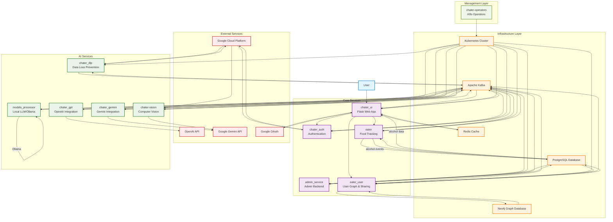
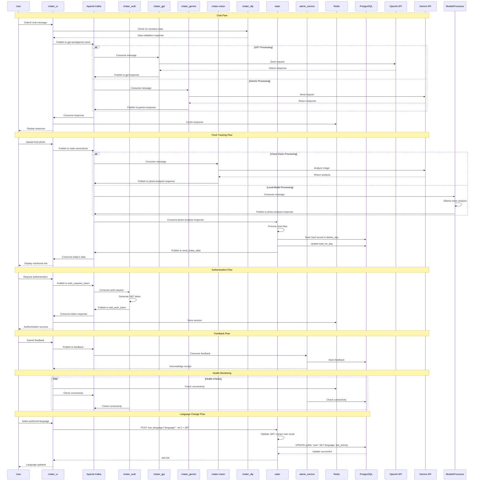

# Chater: Intelligent Chat & Food Tracking Platform

A comprehensive microservices-based application that combines AI-powered chat functionality with intelligent food tracking capabilities. Built with modern cloud-native architecture and featuring seamless integrations with multiple AI providers.

## 🚀 Features

### 💬 AI-Powered Chat
- **Multi-Provider AI Integration**: Support for OpenAI GPT and Google Gemini models
- **Vision Processing**: Advanced image analysis and recognition capabilities
- **Intelligent Responses**: Context-aware conversations with memory persistence
- **Real-time Communication**: Kafka-based messaging for instant responses

### 🍽️ Smart Food Tracking
- **Photo Analysis**: AI-powered food recognition from images
- **Nutritional Insights**: Automated calorie and nutrient tracking
- **Personalized Recommendations**: AI-driven meal suggestions
- **Data Visualization**: Comprehensive food intake analytics
 - **Alcohol Tracking**: Detect alcoholic drinks, log consumption, and query summaries/ranges

### 🔐 Enterprise Security
- **Multi-Factor Authentication**: JWT tokens with Google OAuth integration
- **Data Loss Prevention**: Google Cloud DLP integration for sensitive data protection
- **Session Management**: Redis-based secure session handling
- **Role-Based Access Control**: Fine-grained permission management

### 📊 Modern Architecture
- **Microservices Design**: Scalable, maintainable service architecture
- **Cloud-Native**: Built for Kubernetes with custom operators
- **Real-time Processing**: Apache Kafka for asynchronous communication
- **High Availability**: Resilient design with health checks and monitoring

## 🏗️ Architecture Overview

The system is composed of multiple specialized microservices, each handling specific functionality:

### Core Services
- **chater_ui**: Main Flask web application providing the user interface
- **admin_service**: Administrative functionality and feedback processing
- **chater_auth**: Authentication and authorization service
- **eater**: Food tracking and nutritional analysis service
 - **eater_user**: User search (autocomplete), friendships, and food sharing service

### AI & Processing Services
- **chater_gpt**: OpenAI GPT integration service
- **chater_gemini**: Google Gemini AI integration service
- **chater-vision**: Image processing and computer vision service
- **chater_dlp**: Data Loss Prevention service for sensitive data handling
- **models_processor**: Local LLM integration using Ollama for self-hosted AI processing

### Infrastructure Services
- **chater-operators**: Kubernetes operators for service management
- **Kafka**: Message broker for inter-service communication
- **Redis**: Caching and session management
- **PostgreSQL**: Primary data storage
 - **Neo4j**: Graph database for social relationships

## 🛠️ Technology Stack

### Backend Technologies
- **Python**: Flask web framework, data processing services
- **Java**: High-performance services for authentication and vision processing
- **Protocol Buffers**: Efficient inter-service communication
- **Apache Kafka**: Event streaming and messaging
- **PostgreSQL**: Relational database for persistent storage
- **Redis**: In-memory caching and session store
 - **Neo4j**: Graph database for user relationships

### AI & ML Services
- **OpenAI GPT**: Advanced language model integration
- **Google Gemini**: Multi-modal AI capabilities
- **Google Cloud Vision**: Image analysis and recognition
- **Google Cloud DLP**: Data loss prevention and privacy protection

### Infrastructure & DevOps
- **Kubernetes**: Container orchestration
- **Custom Operators**: Automated service management
- **Ansible**: Infrastructure as Code
- **Docker**: Containerization
- **Google Cloud Platform**: Cloud services and APIs

### Frontend Technologies
- **HTML/CSS/JavaScript**: Modern web interface
- **Flask Templates**: Server-side rendering
- **Bootstrap**: Responsive design framework

## 🚀 Getting Started

### Prerequisites
- **Kubernetes Cluster**: v1.20+ with operator support
- **Docker**: For building and running containers
- **Python 3.8+**: For running development services
- **Java 11+**: For authentication and vision services
- **Apache Kafka**: Message broker setup
- **PostgreSQL**: Database server
- **Redis**: Cache server

### Environment Setup

1. **Clone the repository**
   ```bash
   git clone https://github.com/yourusername/chater.git
   cd chater
   ```

2. **Configure environment variables**
   - Copy `vars.yaml.example` to `vars.yaml`
   - Set your API keys and configuration values
   - Configure database and messaging endpoints

3. **Deploy services**
   ```bash
   ./deploy_all.sh
   ```

### Development Setup

1. **Install Python dependencies**
   ```bash
   pip install -r requirements.txt
   ```

2. **Set up development environment**
   ```bash
   cp .env.example .env
   # Edit .env with your development configuration
   ```

3. **Run individual services**
   ```bash
   # Start the main UI service
   cd chater_ui
   python app/app.py

   # Start the admin service
   cd admin_service
   python app.py
   ```

## 📋 Service Descriptions

### 🌐 chater_ui
**Main Web Application**
- Flask-based web interface
- User authentication and session management
- Real-time chat interface
- Food tracking dashboard
- Google OAuth integration
- Background Kafka consumer service

**Key Features:**
- Session-based authentication
- Rate limiting and security headers
- File upload handling
- Real-time messaging
- Responsive web design

### 🔧 admin_service
**Administrative Backend**
- Feedback processing and management
- Database administration
- System monitoring endpoints
- Background task processing

**Key Features:**
- Kafka-based feedback processing
- PostgreSQL data management
- Health check endpoints
- Async task handling

### 🔐 chater_auth
**Authentication Service**
- JWT token generation and validation
- Google OAuth integration
- User session management
- Security policy enforcement

**Key Features:**
- JWT token lifecycle management
- OAuth provider integration
- Session security
- User authentication flows

### 🍽️ eater
**Food Tracking Service**
- Photo-based food recognition
- Nutritional analysis
- Meal tracking and history
- Personalized recommendations
 - Language preference management

**Key Features:**
- AI-powered food identification
- Calorie and nutrition tracking
- Custom meal logging
- Data visualization
 - JWT-protected endpoint to set user language: `POST /set_language`

### 👥 eater_user
**User Graph & Sharing Service**
- Real-time user email autocomplete via WebSocket (`/autocomplete`)
- Manage friendships using Neo4j (add/check/list friends)
- Share food records/percentages between users
- Produces Kafka events to `photo-analysis-response` and `modify_food_record`
- JWT-protected protobuf endpoints
  - `POST /autocomplete/addfriend`
  - `GET /autocomplete/getfriend`
  - `POST /autocomplete/sharefood`
- Health/readiness endpoints: `GET /health`, `GET /ready`

### 🤖 chater_gpt
**OpenAI Integration**
- GPT model integration
- Conversation context management
- Response generation
- Vision model support

**Key Features:**
- Multi-model support (GPT-4, GPT-3.5)
- Vision capabilities
- Context-aware responses
- Rate limiting

### 💎 chater_gemini
**Google Gemini Integration**
- Gemini model integration
- Multi-modal AI capabilities
- Advanced reasoning
- Image understanding

**Key Features:**
- Gemini Pro and Flash models
- Multi-modal processing
- Advanced AI capabilities
- Real-time responses

### 👁️ chater-vision
**Computer Vision Service**
- Image processing and analysis
- Visual content understanding
- Object detection
- Scene analysis

**Key Features:**
- Advanced image recognition
- Visual question answering
- Content moderation
- Scene understanding

### 🛡️ chater_dlp
**Data Loss Prevention**
- Sensitive data detection
- Content filtering
- Privacy protection
- Compliance monitoring

**Key Features:**
- PII detection and redaction
- Content classification
- Privacy compliance
- Data governance

### 🖥️ models_processor
**Local LLM Integration**
- Self-hosted AI model processing using Ollama
- Privacy-focused local inference
- Cost-effective AI alternative
- Offline AI capabilities

**Key Features:**
- Vision-capable local models (LLaVA, BakLLaVA)
- Text generation with open-source LLMs
- Food recognition and analysis locally
- No external API dependencies
- Unlimited processing without API costs

## 🔧 Configuration

### Service Configuration
Each service can be configured through environment variables:

```yaml
# Database Configuration
POSTGRES_HOST: your-database-host
POSTGRES_DB: your-database-name
POSTGRES_USER: your-database-user
POSTGRES_PASSWORD: your-database-password

# Message Broker
BOOTSTRAP_SERVER: your-kafka-broker:port

# Caching
REDIS_ENDPOINT: your-redis-host

# Graph Database
NEO4J_URI: bolt://your-neo4j-host:7687
NEO4J_USER: your-neo4j-username
NEO4J_PASSWORD: your-neo4j-password

# AI Services
OPENAI_API_KEY: your-openai-api-key
GEMINI_API_KEY: your-gemini-api-key

# Authentication
JWT_SECRET_KEY: your-jwt-secret
GOOGLE_OAUTH_CLIENT_ID: your-oauth-client-id
GOOGLE_OAUTH_CLIENT_SECRET: your-oauth-client-secret

# Eater User Service
EATER_SECRET_KEY: secret-used-to-verify-jwt-in-eater_user
```

### Kubernetes Deployment
Services are deployed using Ansible playbooks and Kubernetes manifests:

```bash
# Deploy all services
ansible-playbook chater.yaml

# Deploy individual services
ansible-playbook chater_ui/chater_ui.yaml
ansible-playbook admin_service/admin.yaml
```

## 🚀 Deployment

### Production Deployment
1. **Prepare your Kubernetes cluster**
2. **Configure secrets and configmaps**
3. **Deploy infrastructure services** (Kafka, Redis, PostgreSQL)
4. **Deploy application services** using the provided Ansible playbooks
5. **Configure ingress and load balancing**

### Development Deployment
1. **Set up local development environment**
2. **Configure local services** (database, message broker)
3. **Run services individually** for development and testing

## 📊 Monitoring & Logging

### Health Checks
All services include health check endpoints:
- `GET /health` - Service health status
- `GET /ready` - Readiness probe
- `GET /metrics` - Service metrics

### Logging
- Structured logging with configurable levels
- ELK stack integration ready
- Request/response logging
- Error tracking and alerting

## 🤝 Contributing

1. **Fork the repository**
2. **Create a feature branch**
3. **Make your changes**
4. **Add tests for new functionality**
5. **Submit a pull request**

### Development Guidelines
- Follow PEP 8 for Python code
- Use meaningful commit messages
- Add documentation for new features
- Ensure all tests pass

## 🏗️ Architecture Diagrams

### System Architecture


### Service Interaction Flow


### Eater Ecosystem Architecture
Complete food tracking system with all services and data flows:

```mermaid
graph TB
    subgraph "User Interface Layer"
        User[User]
        WebUI[chater_ui<br/>Web Interface]
    end
    
    subgraph "Message Broker"
        Kafka[Apache Kafka<br/>Message Bus]
    end
    
    subgraph "Vision Processing Services"
        Vision[chater-vision<br/>Google Vision API]
        ModelsProc[models_processor<br/>Ollama Local Models]
    end
    
    subgraph "Core Food Services"
        Eater[eater<br/>Food Processing Service]
        EaterUser[eater_user<br/>Social & Sharing Service]
    end
    
    subgraph "Data Storage"
        PostgreSQL[(PostgreSQL<br/>Food & User Data)]
        Neo4j[(Neo4j<br/>Friend Graph)]
    end
    
    subgraph "External AI Services"
        GeminiAPI[Google Gemini API<br/>Vision Analysis]
        OllamaLocal[Ollama<br/>Local LLM Runtime]
    end
    
    %% User interaction flow
    User -->|1. Upload photo| WebUI
    User -->|Share food| WebUI
    User -->|Search friends| WebUI
    User -->|Modify record| WebUI
    
    %% Photo upload flow
    WebUI -->|2. Publish photo<br/>eater-send-photo| Kafka
    
    %% Vision processing alternatives
    Kafka -->|3a. Cloud option| Vision
    Kafka -->|3b. Local option| ModelsProc
    
    Vision -->|4a. Analyze image| GeminiAPI
    GeminiAPI -->|5a. Return analysis| Vision
    Vision -->|6a. Publish result<br/>photo-analysis-response| Kafka
    
    ModelsProc -->|4b. Analyze with Ollama| OllamaLocal
    OllamaLocal -->|5b. Return analysis| ModelsProc
    ModelsProc -->|6b. Publish result<br/>photo-analysis-response| Kafka
    
    %% Food processing flow
    Kafka -->|7. Consume analysis| Eater
    Eater -->|8. Process & validate| Eater
    Eater -->|9. Store dishes_day| PostgreSQL
    Eater -->|10. Update total_for_day| PostgreSQL
    Eater -->|11. Store alcohol data| PostgreSQL
    Eater -->|12. Publish result<br/>send_today_data| Kafka
    
    %% Return to UI
    Kafka -->|13. Deliver to UI| WebUI
    WebUI -->|14. Display nutrition| User
    
    %% Query flows
    WebUI -->|Get today's data| Kafka
    Kafka -->|Query request| Eater
    Eater -->|Read data| PostgreSQL
    PostgreSQL -->|Return records| Eater
    Eater -->|Publish response| Kafka
    Kafka -->|Deliver data| WebUI
    
    %% Modification flow
    WebUI -->|Modify/Delete<br/>modify_food_record| Kafka
    Kafka -->|Consume request| Eater
    Eater -->|Update/Delete| PostgreSQL
    Eater -->|Confirm change| Kafka
    Kafka -->|Confirmation| WebUI
    
    %% Social features flow
    WebUI -->|Autocomplete search<br/>WebSocket| EaterUser
    EaterUser -->|Query users| PostgreSQL
    PostgreSQL -->|Return matches| EaterUser
    EaterUser -->|Send results<br/>WebSocket| WebUI
    
    WebUI -->|Add friend| EaterUser
    EaterUser -->|Create relationship| Neo4j
    Neo4j -->|Confirm| EaterUser
    EaterUser -->|Success| WebUI
    
    WebUI -->|Share food| EaterUser
    EaterUser -->|Get food record| PostgreSQL
    EaterUser -->|Calculate portions| EaterUser
    EaterUser -->|Share to friend<br/>photo-analysis-response| Kafka
    EaterUser -->|Modify original<br/>modify_food_record| Kafka
    Kafka -->|Process shared food| Eater
    Eater -->|Store friend's portion| PostgreSQL
    
    %% Weight tracking
    WebUI -->|Manual weight entry| Kafka
    Kafka -->|Weight data| Eater
    Eater -->|Store weight| PostgreSQL
    
    %% Alcohol tracking
    Eater -->|Detect alcohol| Eater
    Eater -->|Store alcohol_consumption| PostgreSQL
    Eater -->|Update alcohol_for_day| PostgreSQL
    WebUI -->|Query alcohol data| Eater
    Eater -->|Return summary| WebUI
    
    %% Language preferences
    WebUI -->|Set language| Eater
    Eater -->|Update user table| PostgreSQL
    
    %% Styling
    classDef userLayer fill:#e1f5fe,stroke:#0277bd,stroke-width:2px
    classDef serviceLayer fill:#f3e5f5,stroke:#7b1fa2,stroke-width:2px
    classDef visionLayer fill:#e8f5e8,stroke:#2e7d32,stroke-width:2px
    classDef dataLayer fill:#fff3e0,stroke:#f57c00,stroke-width:2px
    classDef externalLayer fill:#ffebee,stroke:#c62828,stroke-width:2px
    classDef messageLayer fill:#f1f8e9,stroke:#558b2f,stroke-width:2px
    
    class User,WebUI userLayer
    class Eater,EaterUser serviceLayer
    class Vision,ModelsProc visionLayer
    class PostgreSQL,Neo4j dataLayer
    class GeminiAPI,OllamaLocal externalLayer
    class Kafka messageLayer
```



### Eater Data Flow Summary

#### Photo Analysis Flow
1. **Upload**: User uploads photo via UI
2. **Routing**: UI publishes to `eater-send-photo` topic
3. **Vision Processing**: Either cloud (chater-vision + Gemini) or local (models_processor + Ollama)
4. **Analysis**: Vision service analyzes and extracts food information
5. **Response**: Published to `photo-analysis-response` topic
6. **Processing**: Eater service consumes and validates
7. **Storage**: Stores in `dishes_day` and updates `total_for_day`
8. **Notification**: Publishes result to `send_today_data` topic
9. **Display**: UI consumes and shows nutritional information

#### Food Sharing Flow
1. **Initiate**: User selects food record to share via UI
2. **Request**: UI calls eater_user service with share details
3. **Fetch**: eater_user retrieves original food record from PostgreSQL
4. **Calculate**: Splits food by percentage (e.g., 30% to friend, 70% remains)
5. **Share**: Publishes friend's portion to `photo-analysis-response`
6. **Modify**: Publishes modification to `modify_food_record` topic
7. **Process**: Eater processes both the shared and modified records
8. **Store**: Updates database with adjusted portions

#### Social Features Flow
1. **Autocomplete**: WebSocket connection for real-time email search
2. **Friend Management**: Add/list friends via Neo4j graph database
3. **Food Sharing**: Share food records between friends with portion calculation
4. **Privacy**: JWT-protected endpoints ensure authenticated access

#### Data Queries
- **Today's Data**: Real-time nutritional summaries
- **Historical Data**: Query by specific date
- **Alcohol Tracking**: Latest consumption and date ranges
- **Weight History**: Track weight entries over time
- **Recommendations**: AI-powered meal suggestions

## 🙏 Acknowledgments

- OpenAI for GPT model integration
- Google Cloud Platform for AI and infrastructure services
- Apache Kafka for reliable messaging
- The open-source community for the foundational technologies


Built with ❤️ using modern cloud-native technologies 